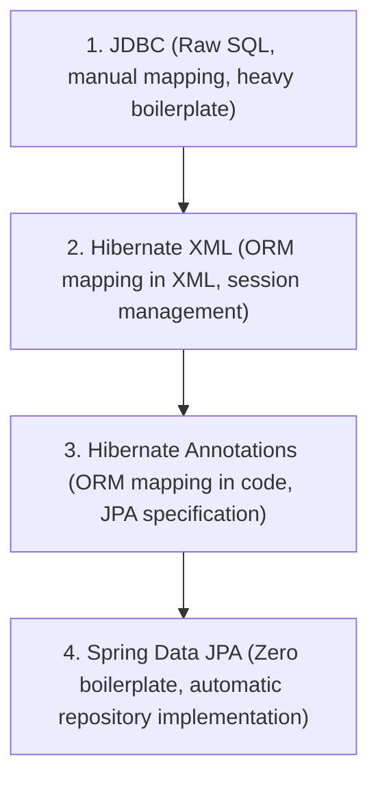

# Evolution of ORM Solutions & Spring Data JPA Demonstration

This guide documents the evolution of Java-based database persistence technologies. It moves from traditional Java Database Connectivity (JDBC) to Object-Relational Mapping (ORM) frameworks like Hibernate (using XML and Annotations), and finally to modern, boilerplate-free Spring Data JPA.

---

## 1. Evolution of Database Persistence in Java



### 1.1 JDBC (Java Database Connectivity)
JDBC was the earliest Java standard for database interaction. It required writing raw SQL statements directly in Java code, manually opening/closing connections, and parsing result sets row-by-row into objects.
*   **Drawbacks**: Heavy boilerplate, database-dependent SQL statements, manual resource management, high risk of SQL injection, and impedance mismatch between Object-Oriented design and Relational Databases.

### 1.2 Hibernate XML Configuration
Hibernate introduced Object-Relational Mapping (ORM) to Java. It allowed Java classes (POJOs) to map directly to database tables. In its initial versions, these mappings were defined in external XML files (e.g., `Book.hbm.xml`).
*   **Drawbacks**: Maintaining separate XML files for every entity became extremely complex as databases grew. Small syntax errors in XML would only be caught at runtime.

### 1.3 Hibernate Annotation Configuration
With Java 5 annotations, Hibernate evolved to support inline mapping metadata directly on Java classes. Developers no longer needed to maintain XML files for entity mappings. They used JPA annotations like `@Entity`, `@Table`, and `@Column`.
*   **Drawbacks**: Developers still had to manage low-level Hibernate APIs like `SessionFactory`, `Session`, `Transaction`, and write repetitive CRUD boilerplate.

### 1.4 Spring Data JPA
Spring Data JPA sits on top of JPA providers (typically Hibernate). It eliminates even the boilerplate DAO/Repository implementations. By extending `JpaRepository<T, ID>`, Spring automatically implements standard CRUD operations and dynamic query generation at runtime.

---

## 2. Structural & Boilerplate Comparison

| Feature | JDBC | Hibernate XML | Hibernate Annotations | Spring Data JPA |
| :--- | :--- | :--- | :--- | :--- |
| **SQL Writing** | Manual (Raw SQL) | Dynamic (HQL/HQL-XML) | Dynamic (HQL/JPQL/Criteria) | None (Derived Queries / JPQL) |
| **Data Mapping** | Manual parsing from ResultSet | Automatic (via `.hbm.xml`) | Automatic (via `@Entity` annotations) | Automatic (via `@Entity` annotations) |
| **Transaction Management**| Manual (`connection.commit()`) | Manual (`session.beginTransaction()`) | Manual / Declarative | Declarative (`@Transactional` / Automatic) |
| **Boilerplate Code** | Extremely High | High (Session/Transaction blocks) | Medium (DAO implementation blocks) | Zero (Interface declaration only) |
| **Database Independence** | Low (SQL dialects differ) | High (Dialect abstraction) | High (Dialect abstraction) | Extremely High (Dialect & Repository abstraction) |

---

## 3. Core Benefits of Hibernate & JPA
1.  **Open Source & Active Community**: Free to use with a vast, mature community providing support, optimizations, and plugins.
2.  **Lightweight**: Minimal runtime footprint. Configurable cache sizes and lazy-loading options ensure high performance.
3.  **Database-Independent Queries (HQL/JPQL)**: Instead of writing database-specific SQL, developers write queries in Hibernate Query Language (HQL) or Java Persistence Query Language (JPQL). Hibernate translates these queries into the target database's dialect automatically.
4.  **Automatic Schema Generation**: Tools like `hbm2ddl.auto` can automatically create, update, or drop tables based on entity definitions.
5.  **Caching**: Built-in First-Level (Session-level) Cache and support for Second-Level (SessionFactory-level) Cache (like Ehcache) significantly reduce database round-trips.

---

## 4. Hands-on Project Implementation

The workspace directory contains 4 separate modules illustrating each configuration. Below is a detailed walkthrough of their key files.

### 4.1 Module 1: Hibernate XML Configuration
*   **Path**: `hibernate-xml/`
*   **Strategy**: Uses `hibernate.cfg.xml` for database properties and `Book.hbm.xml` for mappings.

#### 1. Entity Definition (`Book.java`)
A plain old Java object (POJO) with no annotations:
```java
package com.cognizant.hibernatexml.model;

import java.math.BigDecimal;
import java.time.LocalDate;

public class Book {
    private Long id;
    private String title;
    private BigDecimal price;
    private LocalDate publishDate;
    
    // Default & Parameterized constructors, getters, setters, and toString()
}
```

#### 2. Mapping Configuration (`Book.hbm.xml`)
Maps the POJO to the database table:
```xml
<?xml version="1.0" encoding="utf-8"?>
<!DOCTYPE hibernate-mapping PUBLIC 
 "-//Hibernate/Hibernate Mapping DTD 3.0//EN"
 "http://www.hibernate.org/dtd/hibernate-mapping-3.0.dtd">

<hibernate-mapping>
   <class name="com.cognizant.hibernatexml.model.Book" table="BOOK_XML">
      <id name="id" type="java.lang.Long" column="id">
         <generator class="increment"/>
      </id>
      <property name="title" column="title" type="string"/>
      <property name="price" column="price" type="big_decimal"/>
      <property name="publishDate" column="publish_date" type="java.time.LocalDate"/>
   </class>
</hibernate-mapping>
```

#### 3. Main Configuration (`hibernate.cfg.xml`)
Defines the connection settings and links the mapping file:
```xml
<?xml version="1.0" encoding="utf-8"?>
<!DOCTYPE hibernate-configuration SYSTEM 
"http://www.hibernate.org/dtd/hibernate-configuration-3.0.dtd">

<hibernate-configuration>
   <session-factory>
      <property name="hibernate.connection.driver_class">org.h2.Driver</property>
      <property name="hibernate.connection.url">jdbc:h2:mem:testxmldb;DB_CLOSE_DELAY=-1</property>
      <property name="hibernate.connection.username">sa</property>
      <property name="hibernate.connection.password"></property>
      <property name="hibernate.dialect">org.hibernate.dialect.H2Dialect</property>
      <property name="hibernate.current_session_context_class">thread</property>
      <property name="hibernate.hbm2ddl.auto">create-drop</property>
      
      <mapping resource="com/cognizant/hibernatexml/model/Book.hbm.xml"/>
   </session-factory>
</hibernate-configuration>
```

---

### 4.2 Module 2: Hibernate Annotation Configuration
*   **Path**: `hibernate-annotations/`
*   **Strategy**: Uses JPA annotations inline inside the Java class; the XML file `hibernate.cfg.xml` only registers the annotated class name.

#### 1. Entity Definition (`Book.java`)
```java
package com.cognizant.hibernateannot.model;

import javax.persistence.*;
import java.math.BigDecimal;
import java.time.LocalDate;

@Entity
@Table(name = "BOOK_ANNOT")
public class Book {
    @Id
    @GeneratedValue(strategy = GenerationType.IDENTITY)
    private Long id;

    @Column(name = "title", nullable = false)
    private String title;

    private BigDecimal price;
    private LocalDate publishDate;

    // Constructors, Getters, Setters, toString()
}
```

#### 2. Configuration (`hibernate.cfg.xml`)
Note the mapping element changes from `resource` to `class`:
```xml
<hibernate-configuration>
   <session-factory>
      <!-- DB Properties here ... -->
      <mapping class="com.cognizant.hibernateannot.model.Book"/>
   </session-factory>
</hibernate-configuration>
```

---

### 4.3 Module 3: Spring Data JPA with H2 (In-Memory)
*   **Path**: `spring-data-jpa-h2/`
*   **Strategy**: Bootstrapped by Spring Boot. Zero SessionFactory/Session/Transaction XML configuration. Automatically injects a database engine and connects.

#### 1. Repository Interface (`BookRepository.java`)
No class implementation is required! Spring creates the implementation dynamically.
```java
package com.cognizant.springdatajpah2.repository;

import com.cognizant.springdatajpah2.model.Book;
import org.springframework.data.jpa.repository.JpaRepository;
import org.springframework.stereotype.Repository;
import java.util.List;

@Repository
public interface BookRepository extends JpaRepository<Book, Long> {
    // Generates select b from Book b where b.title like %?1%
    List<Book> findByTitleContaining(String title);
}
```

#### 2. Application Properties (`application.properties`)
Configuration is extremely clean, declarative, and managed via key-value pairs:
```properties
spring.datasource.url=jdbc:h2:mem:springdatajpah2db;DB_CLOSE_DELAY=-1
spring.datasource.driver-class-name=org.h2.Driver
spring.datasource.username=sa
spring.datasource.password=
spring.jpa.database-platform=org.hibernate.dialect.H2Dialect
spring.jpa.hibernate.ddl-auto=update
spring.jpa.show-sql=true
```

---

### 4.4 Module 4: Spring Data JPA with MySQL
*   **Path**: `spring-data-jpa-mysql/`
*   **Strategy**: Similar code to the H2 module, but utilizes MySQL properties. Includes graceful error logging if the local MySQL service is inactive.

#### Properties Configuration (`application.properties`)
```properties
spring.datasource.url=jdbc:mysql://localhost:3306/testdb?useSSL=false&serverTimezone=UTC&allowPublicKeyRetrieval=true
spring.datasource.driver-class-name=com.mysql.cj.jdbc.Driver
spring.datasource.username=root
spring.datasource.password=password
spring.jpa.database-platform=org.hibernate.dialect.MySQLDialect
spring.jpa.hibernate.ddl-auto=update
spring.jpa.show-sql=true
```

---

## 5. How to Compile and Execute the Project

All four modules are managed by a single Maven parent POM. You can build and run them as follows:

### 5.1 Build the Entire Project
Navigate to the root directory `c:\Users\ram\Documents\cognizant\1. spring-data-jpa-handson\` and compile the modules using Maven:
```powershell
C:\Users\ram\.gemini\antigravity\maven-temp\apache-maven-3.8.8\bin\mvn.cmd clean package
```

### 5.2 Execute Individual Modules
You can run the main classes of the modules directly using Maven or Java:

#### 1. Run Hibernate XML Demo
```powershell
C:\Users\ram\.gemini\antigravity\maven-temp\apache-maven-3.8.8\bin\mvn.cmd exec:java -pl hibernate-xml -Dexec.mainClass="com.cognizant.hibernatexml.App"
```

#### 2. Run Hibernate Annotations Demo
```powershell
C:\Users\ram\.gemini\antigravity\maven-temp\apache-maven-3.8.8\bin\mvn.cmd exec:java -pl hibernate-annotations -Dexec.mainClass="com.cognizant.hibernateannot.App"
```

#### 3. Run Spring Data JPA with H2 (In-Memory) Demo
```powershell
C:\Users\ram\.gemini\antigravity\maven-temp\apache-maven-3.8.8\bin\mvn.cmd spring-boot:run -pl spring-data-jpa-h2
```

#### 4. Run Spring Data JPA with MySQL Demo
```powershell
C:\Users\ram\.gemini\antigravity\maven-temp\apache-maven-3.8.8\bin\mvn.cmd spring-boot:run -pl spring-data-jpa-mysql
```
